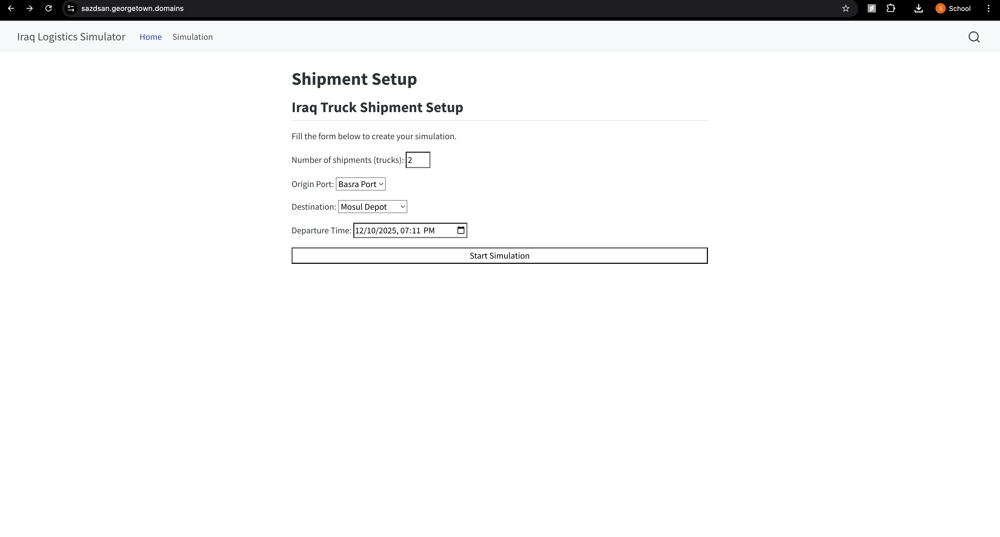
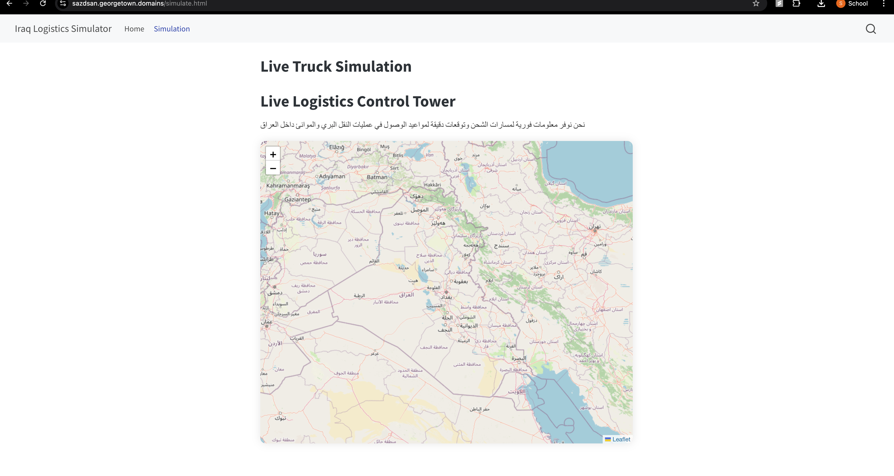
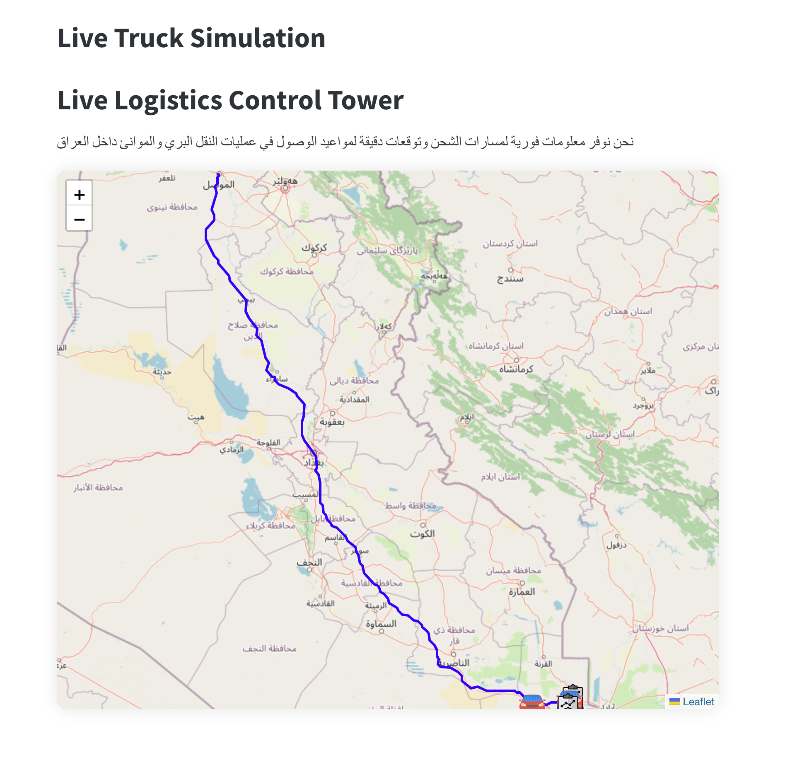
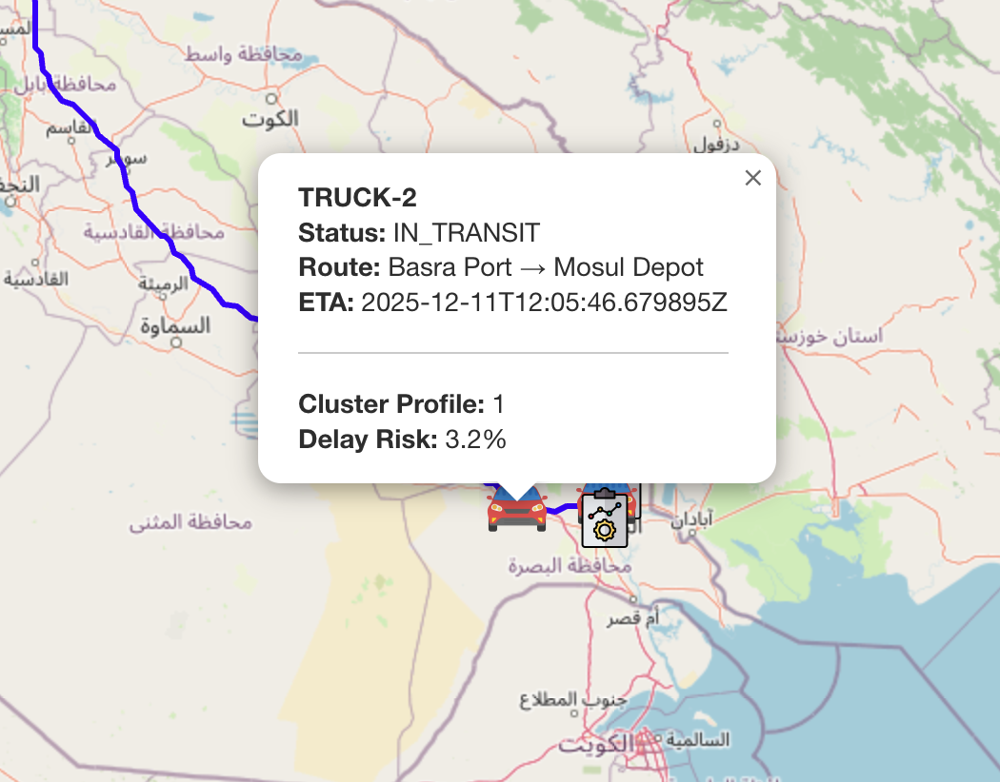

---

# **📝 `report.qmd` – Full Written Report**

```markdown
---
title: "End-to-End Report"
format: html
---

# Executive Summary

Having experienced how ineffective shipment trackers are in the middleeast firsthand, we decided to deliver a complete real-time supply chain visibility and route optimization platform designed to support logistics companies operating import and export flows across the middle east. Using Iraq as the demonstration environment, the system simulates trucks moving between major logistics hubs, generates shipment events, ingests data through a cloud-based architecture, and visualizes vehicle movement on an interactive dashboard.

This platform allows the users (managers or buyers) to track shipments and moniter the progress in real time. The app also tells us the most effecient path for the truck or shipment. This was done by integrating OSRM routing, ETA predictions, and geospatial analytics. 


# Objective

The goal here is to build a cloud-powered tool helping shipping firms track cross-border shipments more effectively, specifically in the middle east, by using digital routes updated live. Instead of guessing, managers get instant updates on where trucks are, so they can react fast when detours happen. Alerts pop up if deliveries go off schedule, giving teams time to adjust plans ahead. Arrival predictions at hubs like docks or warehouses stay current thanks to constant data feeds from vehicles in motion.

To summarize, this project aims to:

* Build one online space so truck spots, delivery updates, or travel details stay fresh and ready to check.
* Implement automated routing logic that identifies the most efficient paths between origin and destination hubs.
* Fix daily hiccups with smart tips to help assign tasks, plan shifts, or manage tools on hand.
* Demonstrate how a scalable cloud architecture can streamline data ingestion, processing, and visualization for both domestic and cross-border logistics operations.

Reaching these goals helps keep operations running smoothly, cuts shipping expenses, while boosting how well goods get delivered - especially when competition heats up.
 
# Key Insights

The review plus live demos gave useful insights that matter when firms handle goods moving in or out. Different examples showed clear ways to tweak how shipping tasks run day-to-day

1. Instant updates cut confusion across truck fleets
Managers see truck spots and load updates live, so they catch hiccups right when things go off track. With this clear view, planning pickups gets sharper while team check-ins by phone or email drop way down.

2. OSRM-built routes link logistics centers quickly - using smart pathfinding that’s trusted daily. These connections save time while cutting delays, so shipments move smoother across regions.

The OSRM routing setup gave smooth, clean routes connecting main spots - Basra Port, Baghdad, Mosul, Erbil, Kirkuk. Because of this, trips got shorter; less ground covered means better fuel use. Instead of random roads, drivers now follow smarter lines that save time, skip detours. Efficiency goes up without extra effort.

3. Predicted arrival times make it easier to time deliveries along the route - using updates from one stop improves coordination at the next
The system works out live arrival guesses by measuring distances with a math method while tracking trip progress. So, places ahead - like warehouses or drop-off spots - can get ready when loads are close, which helps speed things up instead of causing delays from crowding.

4. Fewer manual steps mean smoother workflows - automated intake plus tidy-up cut daily hiccups. 
Events arrive via API Gateway - Lambda handles them in batches, checks accuracy, then formats uniformly before saving to DynamoDB automatically. No human steps needed here, cutting mistakes from manual input while setting up reliable results for reports and analysis down the line.

5. Watching the route helps you decide better while handling unexpected issues
Interactive maps show truck paths, so odd turns pop up quick. When routes shift suddenly, bosses notice right away. Instead of waiting, they redirect trucks on the fly. This way, help goes where it’s needed before delays stack up.

6. Checking shipments through multiple ways improves how well plans work when moving goods across borders. Keeping tabs on trucks and fake ship arrivals at Basra Port shows how seeing both sea and road moves helps improve overall shipping plans.

These findings suggest live updates, smart path choices, or instant maps give logistics firms a solid edge when working in fast-moving, high-pressure settings.

# Visualizations

1. Real-time Truck Location Simulation



2. Real-time Truck Location Map



3. Route Polylines Between Major Hubs



4. Real-time Truck Location Map with ML statistics




# Business Implications

The platform developed in this project has several important implications for logistics companies seeking to improve operational efficiency, reduce costs, and strengthen reliability across import and export workflows.

1. Improved Operational Visibility Reduces Delays and Disruptions

Trucks can be followed live, so you always know their spot, distance covered, or if they’ve strayed off course. With this clear view, supervisors catch hiccups sooner, step in without waiting, keeping small glitches from turning into late deliveries. When choices happen quicker, hold-ups drop. Real clarity means less guesswork, better timing.

2. Optimized Routing Leads to Lower Transportation and Fuel Costs

Using OSRM helps create smart routes that stick to real roads, cutting down wasted distance and unnecessary driving. When a delivery business moves stuff between places often, tiny improvements add up - saving money on gas, repairs, plus time behind the wheel.

3. Accurate ETAs Improve Coordination with Depots, Ports, and Customers

Fairly accurate arrival guesses help places like Basra Port, land hubs, or local drop-off spots organize workers, lifting tools, and find room to stash goods with less hassle. Smoother timing eases crowding, avoids ramp holdups, also builds trust with buyers who want stuff on schedule.

4. Data Automation Reduces Manual Work and Minimizes Errors

Automated intake via API Gateway plus Lambda cuts out manual errors, keeping shipping details consistent. Because data stays accurate and solid, it works well for reports, predictions, or checking progress later on. Staff can then spend time handling unusual cases instead of chasing standard updates.

5. Enhanced Fleet Utilization Supports Higher Throughput

Fleet tracking helps dispatchers see where trucks are right now - so they can spread jobs more evenly instead of piling them on a few. If some rigs sit idle, they get sent where work’s picking up - or moved ahead of busy times coming soon. Using each truck better means moving more stuff overall, even if no new trucks join in.

6. Multi-Modal Insights Strengthen Import/Export Planning

With trucks and fake ship models on board, the system shows how clear tracking boosts movement - from docks to land routes. Because everything’s linked, businesses can guess when things arrive, handle crowded yards easier, also keep products moving smoothly along the way.

7. Foundational Infrastructure for Predictive and Prescriptive Analytics

The system not only supports current operations but also lays the groundwork for higher-value functions such as:

• Delay forecasting
• Dynamic route adjustments
• Anomaly detection
• Driver performance monitoring
• Demand-driven dispatch planning

These analytics can meaningfully enhance profitability and service reliability.

# Recommendations

Based on the capabilities demonstrated by the platform and the insights gained from the simulation, several practical steps are recommended to enhance operational efficiency, strengthen logistics planning, and maximize business value.

1. Automate Exception Alerts for Faster Interventions

Watching things live helps, yet getting instant notifications turns it into action. Suggested alerts are:

* Trucks falling behind expected progress
* Deviations from OSRM-recommended routes
* Significant ETA changes
* Staying inactive for too long

These warnings help the crew act fast - so delays happen less often.

2. Expand Route Optimization to Support Dynamic Rerouting

The existing routing system identifies an optimal path before the trip. Integrating dynamic rerouting would allow:

* Alternate paths during traffic disruptions
* Route adjustments based on weather or security advisories

This improves reliability for both import and export shipments.

3. Enhance Multi-Modal Integration for Port-Centric Operations

Since the business manages both inbound and outbound flows, the system should expand its multi-modal tracking by adding:

* Vessel arrival predictions
* Container handling events
* Port congestion metrics
* Synchronization of truck dispatch with vessel berthing schedules

These additions would directly improve turnaround times at Basra Port and other maritime gateways.


# Conclusion

This project shows how a cloud-powered tool for tracking shipments and planning routes can boost day-to-day efficiency for businesses handling international trade. Instead of guessing, teams get live updates, automatic info entry, smarter path choices, also clear dashboards - making it easier to depend on deliveries, cut expenses, while guiding better calls.

The simulation shows how  optimized OSRM routes, live arrival estimates, and ongoing tracking gives a solid picture of truck movements through Iraq’s supply chain. With these tools, supervisors can spot holdups early, adjust quickly when situations shift, and manage equipment smarter at terminals, storage spots, or regional hubs.

Beyond immediate operational benefits,  the platform establishes the groundwork for advanced analytics - like spotting delays, flagging odd patterns, or adjusting routes on the fly. With time, as data builds up, the business can use these tools to run smoother, avoid problems, and keep clients happier in fast-moving shipping sectors.

On top of everything, this project gives a hands-on way to build a current logistics hub - mixing live info, location-based insights, also flexible cloud power to keep upgrading every part of the delivery network.

